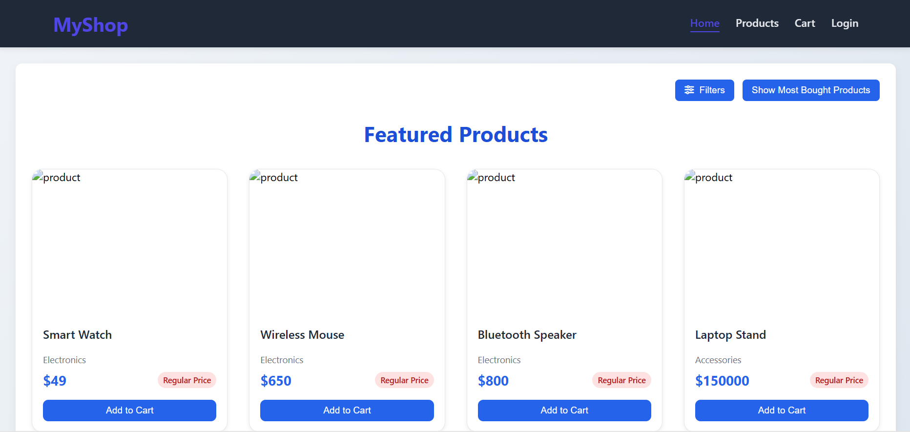
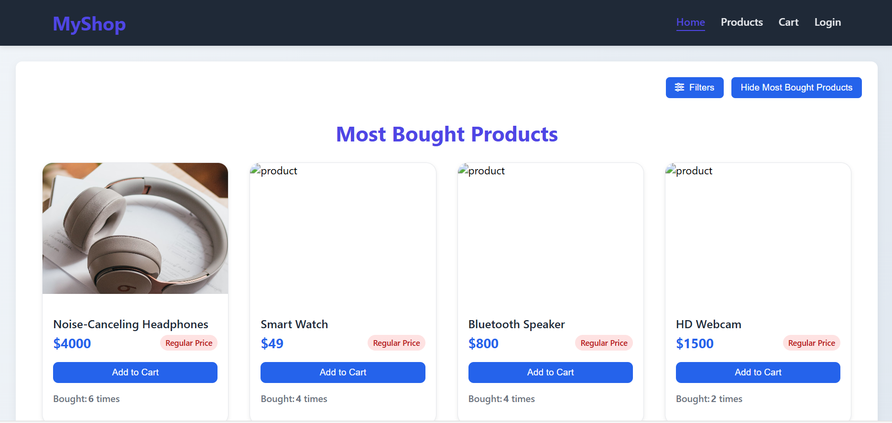
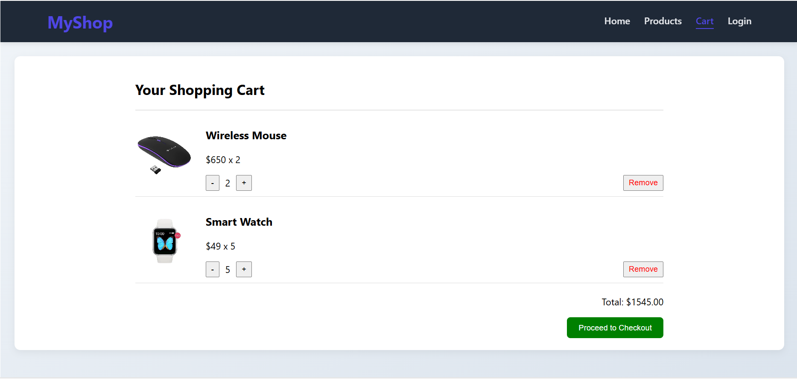
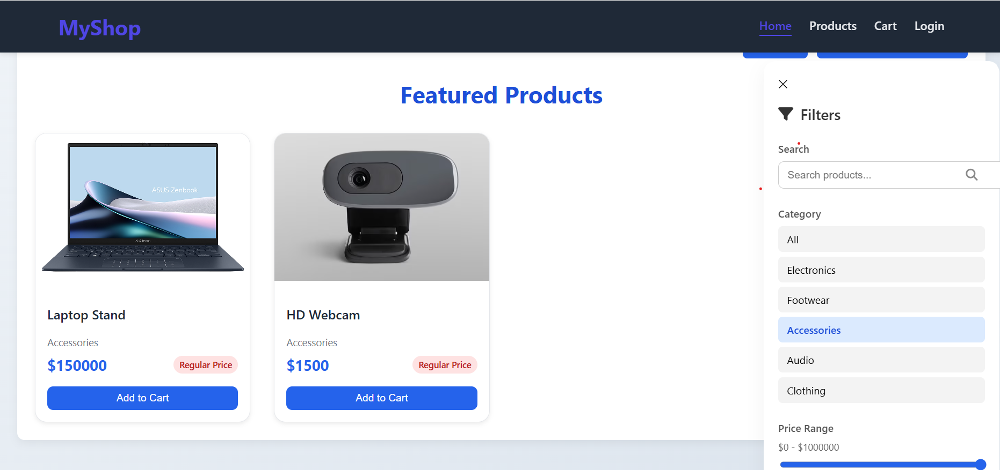
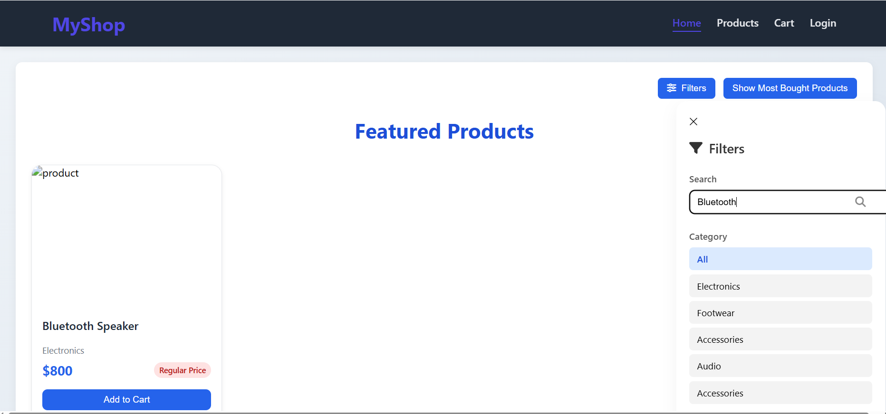

# 🛒 E-Commerce App

A simple e-commerce web application built using **Django (DRF)** for the backend and **Vue.js** for the frontend. This app allows users to browse products, add them to cart, and place orders. Authentication is done via mobile OTP login.

---

## ✨ Features

- Login via mobile number (OTP stub)
- Browse products with filtering and search
- Add/remove items from cart
- Place and cancel orders
- Admin interface for managing products

---

## 📸 Screenshots

### 🏠 Home Page  


### 🛍️ Most Bought Product  


### 🛒 Cart View  


### 🔎 Filter View  



---

## ⚙️ Tech Stack

- **Backend:** Django, Django REST Framework
- **Frontend:** Vue 3, Vuex, Vue Router, Fetch API
- **Database:** SQLite (dev)
- **Authentication:** OTP-based login (simulated)

---

## 🧑‍💻 Installation & Setup

### 📂 Clone the Repo

```bash
git clone https://github.com/CHARLIE1210-A/E-Commerce.git
```

### Backend Setup
```bash
cd backend
python -m venv venv         # set virtual environment
venv/Scripts/activate       # activate environment
pip install -r requirements.txt
```
**Migrate and Run the server**

```bash
python manage.py makemigrations
python manage.py migrate
python manage.py runserver
```

**Your backend is now running at :**
```bash
http://localhost:8000/
```

### Frontend Setup(Vue.js + vuex)

```bash
cd frontend
npm install
```

**Run Vue server**
```bash
npm run serve
```

**Your frontend is now running at :**
```bash
http://localhost:8080/
```

## Project Structure
```bash
e-commerce/
│
├── backend/                          # Django Backend
│   ├── store/                        # Main Django app
│   │   ├── __init__.py
│   │   ├── admin.py                  # Admin registration
│   │   ├── apps.py
│   │   ├── models.py                 # User, Product, Cart, Order models
│   │   ├── serializers.py            # DRF serializers
│   │   ├── urls.py                   # App-specific routes
│   │   ├── utils.py                  # App-specific utilities
│   │   ├── views.py                  # API views
│   │   └── migrations/
│   │       └── __init__.py
│   │
│   ├── ecommerce/                    # Django Project
│   │   ├── __init__.py
│   │   ├── settings.py
│   │   ├── urls.py                   # Project-level URLs
│   │   ├── asgi.py
│   │   └── wsgi.py
│   │
│   ├── db.sqlite3                    # Database
│   ├── manage.py
│   └── requirements.txt             # Backend dependencies
│
├── frontend/                         # Vue Frontend
│   ├── public/                       # Public assets
│   │   └── index.html
│   │
│   ├── src/
│   │   ├── assets/ 
│   │   │   ├── main.css             # main css
│   │   ├── components/              # Vue components
│   │   │   ├── Header.vue
│   │   │   ├── ProductCard.vue
│   │   │   └── CartItem.vue
│   │   │
│   │   ├── views/                   # Pages (views)
│   │   │   ├── HomePage.vue
│   │   │   ├── NotFound.vue
│   │   │   ├── Orders.vue
│   │   │   ├── ProductDetail.vue
│   │   │   ├── ProductList.vue
│   │   │   ├── CartPage.vue
│   │   │   ├── Checkout.vue
│   │   │   └── LoginPage.vue
│   │   │
│   │   ├── router/                  # Vue Router setup
│   │   │   └── index.js
│   │   │
│   │   ├── store/                   # Vuex Store
│   │   │   └── index.js
│   │   │   └── modules/
│   │   │       └── auth.js
│   │   │       └── cart.js
│   │   │       └── filters.js
│   │   │       └── orders.js
│   │   │       └── products.js
│   │   │
│   │   ├── App.vue
│   │   └── main.js
│   │
│   ├── package.json
│   ├── vite.config.js
│   └── README.md
│
├── .gitignore
└── README.md
```
